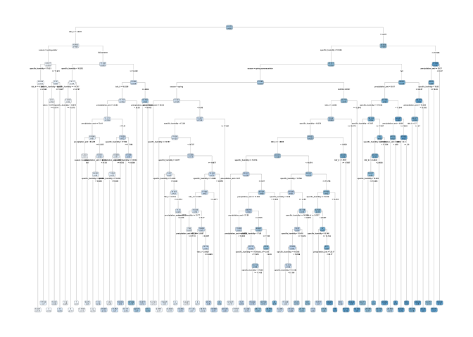
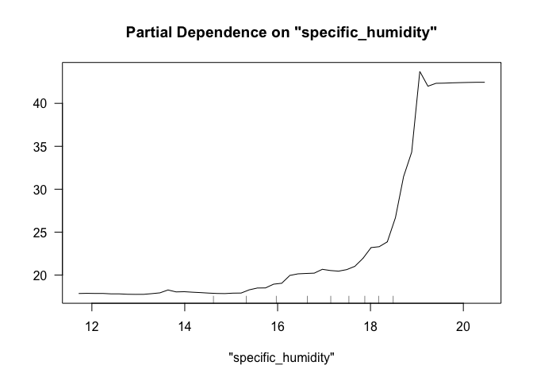
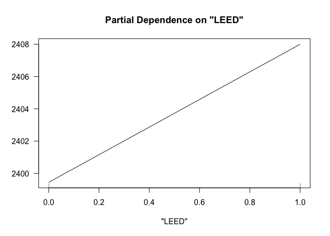
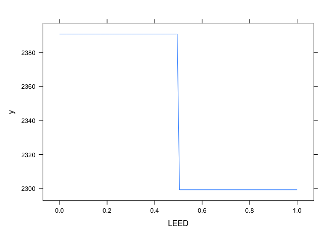

Problem 1: What causes what?
============================

Why can’t I just get data from a few different cities and run the regression of “Crime” on “Police” to understand how more cops in the streets affect crime? (“Crime” refers to some measure of crime rate and “Police” measures the number of cops in a city.)
---------------------------------------------------------------------------------------------------------------------------------------------------------------------------------------------------------------------------------------------------------------

Firstly, grouping data from different cities makes the incorrect
assumption that the data points are independently and identically
distributed among cities. Crime rates and police measures vary among
cities, and factors that influence these two variables, such as, police
budgets, population, income levels, criminal punishments, etc. also vary
amongst cities. As a result, combining data from different cities could
distort the outcome of the regression. Secondly, while police measures
affect crime rates, crime rates also affect the level of police
measures, leading to a simultaneous causality bias. Thirdly, there is a
lack of control variables in the regression as crime rates can be
influenced by several other variables as mentioned above; this could
lead to incorrect estimation of the effect of “Police” on “Crime”.

How were the researchers from UPenn able to isolate this effect? Briefly describe their approach and discuss their result in the “Table 2” below, from the researchers’ paper.
------------------------------------------------------------------------------------------------------------------------------------------------------------------------------

The researchers from UPenn narrowed down their research to only one
city, Washington, D.C., assuming that the data points would be
identically distributed within a city. To deal with the simultaneous
causality bias, they chose Washington, D.C. because it is more likely to
be a terrorism target compared to other cities in the U.S. This allowed
the researchers to utilize the “High Alert” variable as the instrument
variable to address simultaneity. In other words, when there is High
Alert (High Alert = 1), extra police is deployed in the city to protect
against terrorists; in this setup the deployment of the extra police is
not directly related to the variable of interest, “Crime”. So, the High
Alert variable is able to capture the effect of police measures on crime
rates without crime rates affecting police measures. They also added the
log of midday ridership on the Metro as a control variable to test
whether there were fewer victims out in the city becuase of the High
Alert.

Table 2 summarizes their results as two regressions. The first
regression only utilizes the High Alert dummy variable to estimate the
effect of police on the daily total number of crimes in D.C. This leads
to -7.316 as the coefficient on High Alert which is significant at the
5% level. It means that on a High Alert day, the daily total number of
crimes in D.C. by 7.316 units, holding all else constant. The R-squared
for this regression is 0.14, which means only 14% of the variation in
crime rates in D.C. is described by the covariate in the model.

The second regression adds the log of midday ridership to the first
regression as a control variable. This leads to -6.046 as the
coefficient on High Alert at the 5% significance level, meaning that on
a High Alert day, the daily total number of crimes in D.C. falls by
6.046 units, holding all else constant. The coefficient on “Log(midday
ridership)” is 17.341 which is significant at the 1% level. This means
if midday ridership on the Metro increases by 1 percent, the daily total
number of crimes in D.C. increase by 0.173 units, holding all else
constant. The R-sqaured of this regression, 0.17, is slightly higher
than that of the first regression. It means only 17% of the varation in
crime rates in D.C. is described by the covariates in the model. Given
that, since both of the coefficients in this regression are
statistically significant at the 5% and 1% level, respectively, the
second regression performs better than the first regression, although by
only a small margin.

Why did they have to control for Metro ridership? What was that trying to capture?
----------------------------------------------------------------------------------

It is possible that on High Alert days, fewer people are out in the city
due to higher threat levels of terrorism. Fewer people out in the city
means fewer victims of crime which could lead to lower crime rates.
Therefore, to account for this effect, Metro ridership needs to be
controlled for. Metro ridership attempts to capture the number of
potential victims of crime based on the changes in ridership with
respect to High Alert days.

Below I am showing you “Table 4” from the researchers’ paper. Just focus on the first column of the table. Can you describe the model being estimated here? What is the conclusion?
-----------------------------------------------------------------------------------------------------------------------------------------------------------------------------------

The researchers are estimating the district-specific effects of High
Alert days on the daily total number of crimes in D.C., while
controlling for Metro ridership using a multiple regression approach
with heteroscedastic errors. They introduce two district dummy
variables, “District 1” and “Other Districts” and interact both the
district dummy variables with the the High Alert variable to estimate
district-specific effects. The coefficient on “High Alert x District 1”
shows that on a High Alert day in District 1, the daily total number of
crimes in D.C. falls by 13.679 units, holding all else constant. This
coefficient is statistically significant at the 1% level. Similarly, the
coefficient on “High Alert x Other Districts” shows that on a High Alert
day in any other district, the daily total number of crimes in D.C.
falls by 11.629 units, holding all else constant. These results reflect
that a High Alert day in District 1 reduces crime rates more than a High
Alert day in any other district. However, the coefficent on “High Alert
x Other Districts” is not statistically significant. Lastly, the
coefficient on “Log (midday ridership)” reflects that a 1 percent
increase in midday ridership on the Metro increases the daily total
number of crimes in D.C. 2.477 units, holding all else constant. This
coefficient is statistically significant at the 5% level.

Given the statisical significance of the coefficients, it can be
concluded that having a High Alert day in District 1 reduces the daily
total number of crimes in D.C. by 13.679 units, holding all else
constant. However, a comparison between District 1 and Other Districts
cannot be made due the lack of significance of the “High Alert x Other
Districts” coefficient.

Problem 2: Tree modeling: dengue cases
======================================

CART model: Regression Tree
---------------------------

### Pruned regression tree at the 1 standard error complexity level

### RMSE of predicting the regression tree on the test set

    ## [1] 29.93283

Random Forests
--------------

### RMSE of predicting random forest on the test set

    ## [1] 27.69444

Gradient-Boosted Trees
----------------------

### Gaussian distribution

    ## [1] 85

The figure above displays a loss function as a result of n trees added
to the ensemble for the chosen gradient boosted machine (gbm) model .
The model assumes gaussian distibution with 500 trees. The squared error
loss is shown on the y-axis and numbers of trees is on the x-axis. It
can be seen that the cross-validated errors represented by the green
line are minimized between 40 to 90 trees. Therefore, the ideal number
of trees to minimize error while accounting for overfitting would be
100.

The RMSE between the predicted total number cases of dengue from the
chosen gbm model and the actual total number of cases of dengue from the
test set is shown below.

    ## [1] 28.23562

### Poisson distribution

This gbm model assumes poisson distibution since the variable of
interest is a count variable. All parameters are the same as for the
model shown above, except the number of trees is 100 based on the loss
function above. The RMSE between the predicted total number cases of
dengue from the chosen gbm model and the actual total number of cases of
dengue from the test set is shown below.

    ## [1] 28.84149

Since, the RMSE for the second gbm model is the lowest out of all the
models observed above, it will be utilized to create partial dependence
plots for the following variables: specific\_humidity,
precipitation\_amt, and tdrk\_k.

Partial dependence plots
------------------------

### specific\_humidity

The average specific humidity in grams of water per kilogram of air for
the week. This is a raw measure of humidity based purely on how much
water is in the air.

### precipitation\_amt

Rainfall for the week in millimeters.

### tdtr\_k

The average Diurnal Temperature Range (DTR) for the week. DTR is the
difference between the maximum and minimum temperature for a single day.

Problem 3: Predictive model building: green certification
=========================================================

Goal
----

The goal is to build the best predictive model possible for revenue per
square foot per calendar year, and to use this model to quantify the
average change in rental income per square foot ssociated with green
certification, holding other features of the building constant.

Methods
-------

I first created a new data frame with a ***revenue*** column which is a
product of the ***Rent*** and ***leasing\_rate*** variables. Then to
decide whether to include the green certifications of ***Energystar***
and ***LEED*** separately or as a single green certification rating, I
performed some exploratory analysis. I plotted ***mean\_revenue***
against ***age*** faceted first by ***Energystar*** and
***renovation***, and then by ***LEED*** and ***renovation***. I assumed
that property age would be among the top influencers for mean revenue,
so faceting the data by ***Energystar*** and ***LEED*** would reveal
clearer effects of the two ratings on the mean revenue. I also faceted
by ***renovation*** assuming that for older buildings, renovated
properties are more likely to have green ratings. The plots reflect that
buildings with the LEED certification tend to have lower mean revenues
than the buildings with the Energystar certification, therefore I
decided to include both the certification separately.

Modeling approach
-----------------

### Random Forests

I began by splitting 80% of the data into the training set and 20% into
the testing set. I started with the random forests technique as it is
quite robust, quick, and basically eliminates the need for
cross-validation due to its “out-of-bag” predictions. I first utilized
all of the features in the training set and calculated the resulting
RMSE between the predcited revenue and the actual revenue in the testing
set which is shown below. It is

    ## [1] 775.0415

To identify the important variables in the random forest model, I
plotted the variable importance graph shown below. It can be seen that
***hd\_total07***, ***LEED***, ***green\_rating***, ***net***, and
***Energystar*** are the least important variables in that order
(decreasing in importance).

Since ***LEED*** and ***Energystar*** are the variables under
consideration, I created a new model by removing the other least
important variables mentioned above to check for RMSE improvement in the
new model. The RMSE of the new model is shown below. It is slightly
lower than that of the previous model.

    ## [1] 776.3518

The partial dependence plots (pdp) for the ***LEED*** and
***Energystar*** variables using the second random forests model are
shown below.

#### Conclusion

The pdp for LEED shows that when LEED = 0, the predicted revenue per
square foot per calendar year is 2450 and when LEED = 1, the predicted
revenue per square foot per calendar year is slightly above 2600.
Likewise, the pdp for Energystar shows that when Energystar = 0, the
revenue per square foot per calendar year is slightly below 2435 and
when Energystar = 1, the revenue per square foot per calendar year is
approximately 2465. These plots reflect that the revenue predictions for
buildings with green ratings are higher than buildings without a green
rating, holding all else constant. Furthermore, buildings with LEED
ratings have higher predicted revenues than buildings with Energystar
ratings, holding all else constant.

### Gradient Boosting (Model of Choice)

I utilized the same training and test splits to evaulate a gradient
boosted model with 10-fold cross validation. I assumed the Gaussian
distribution with the following parameters: interaction.depth = 4,
n.trees = 10000, shrinkage = .05. I ended up choosing such a high number
of trees becuase the loss function kept showing the n-th tree as the
mean-squared-error minimizer until I chose 10,000 and received a 9000+
number as the mean-squared-error minimizer. The number of trees that
minimized te mean-squared-error and a plot of the loss function is
displayed below.

    ## [1] 9999

The RMSE between the predicted revenue and the actual revenue from the
test set is dislayed below. It is lower than that of the random forests
model. Therefore, this model will be the model of choice.

    ## [1] 787.5751

#### Conclusion

The pdp for LEED shows that when LEED = 0, the predicted revenue per
square foot per calendar year is 2400 (lower than random forests’
prediction) and when LEED = 1, the predicted revenue per square foot per
calendar year is approximately 2750 (higher than random forests’
prediction). Likewise, the pdp for Energystar shows that when Energystar
= 0, the revenue per square foot per calendar year is approximately 2395
(lower than random forests’ prediction) and when Energystar = 1, the
revenue per square foot per calendar year is approximately 2445 (lower
than random forests’ prediction). These plots reflect that the revenue
predictions for buildings with green ratings are higher than buildings
without a green rating, holding all else constant. Furthermore,
buildings with LEED ratings have higher predicted revenues than
buildings with Energystar ratings, holding all else constant.
